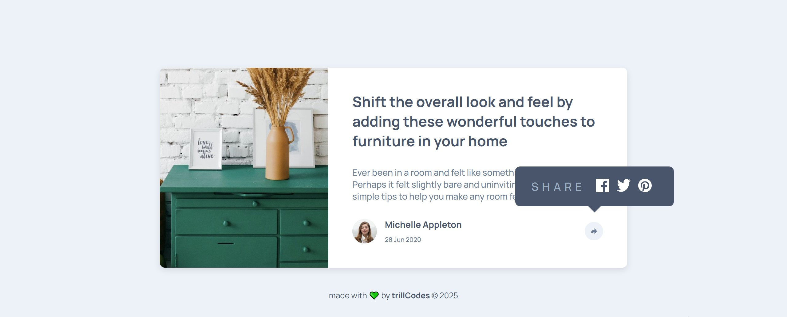

# Frontend Mentor - Article preview component solution

This is a solution to the [Article preview component challenge on Frontend Mentor](https://www.frontendmentor.io/challenges/article-preview-component-dYBN_pYFT). Frontend Mentor challenges help you improve your coding skills by building realistic projects. 

## Table of contents

- [Overview](#overview)
  - [The challenge](#the-challenge)
  - [Screenshot](#screenshot)
  - [Links](#links)
- [My process](#my-process)
  - [Built with](#built-with)
  - [What I learned](#what-i-learned)
  - [Continued development](#continued-development)
  - [Useful resources](#useful-resources)
- [Author](#author)
- [Acknowledgments](#acknowledgments)


## Overview

### Screenshot




### Links

- Solution URL: [Github repo to the code for the challenge](https://github.com/AllisonFavour/fm-challenge8)
- Live Site URL: [Vercel link to view the challenge](https://article-preview-component-two-gamma.vercel.app/)

## My process

Started with structuring my HTML with the end styling in mind which i have come to understand is a key process. Before coding it out, i try to take my time while carefully observing the figma design or in this case, the design preview image provided because i am using the free version of frontend mentor.

In the HTML file, under the body element, i created two sibling elements which are main and footer for semantic purpose.
main element has a child div with the class name of .main, directly under .main, i used a section element with the class name of .container (used section for semantic purpose)
section.container is the parent to drawer img and div.content
div.content is a sibling to img, and a parent to h1, p, div.flex and div.mobile-share (which is initially set to display: none)
div.flex is a parent to div.profile and img.share-icon
div.profile has two child elements which are img.avatar and div.info
div.info also has two child elements which are span for .name and .date

The purpose of arranging my elements like this greatly helped me achieve the finalized look of the provided design preview.

In the CSS file i began by importing the specified font from google font using the @import directive, then i did the css reset to remove the default padding, margin and make the box-sizing: border-box.
I created variables for the colors and fonts, then i set the font-size on the root to 13px to enable me use rem which is also good practice for responsiveness

The styles are quite explanatory and i added some comments to the SCSS file to aid with code readability


### Built with

- Semantic HTML5 markup
- CSS custom properties and Flexbox and Grid
- Javascript


### What I learned

I learnt how using display flex on the body is a good practice to center all consecutive child elements, this helps in responsiveness with other techniques to keep the contents at the center of the device screen, either mobile, desktop or any screen size. I also learnt using position property on certain elements helps in controlling the layout and position styling of those elements.

I learnt how to create a caret tooltip for when the .share-menu pops up after the click of the .share-icon button

```css
      .show::after {
        content: "";
        position: absolute;
        bottom: -20px; // Moves it below .share-menu
        left: 50%;
        transform: translateX(-50%);
        border-width: 10px;
        border-style: solid;
        border-color: $VeryDarkGrayishBlue transparent transparent transparent;
      }

```

I was having issues making the height of both the image on the left side and .content on the right side for wider screens to sync and be same height without overflowing, making use of flex and align-items: stretch helped solve that

```css

  .container {
    width: 760px;
    height: fit-content;
    display: flex;
    flex-direction: row;
    align-items: stretch;
    border-radius: 8px;
    position: relative;
  }

```

I also learnt how to efficiently use Javascript for styling purpose, by simply adding an already styled class which i use javascript to add, in this case for every click javascript toggles the class name of .show

```js
const shareButton = document.getElementById("js-share-btn");
const shareDiv = document.getElementById("js-mobile-share");

shareButton.addEventListener("click", () => {
  shareDiv.classList.toggle('show');
});


getYear();

function getYear() {
  document.getElementById('js-year').textContent = new Date().getFullYear();
}
  
```
 


### Continued development

Ensure its responsiveness to a variety of screens


## Author

- Website - [Allison Favour](https://allison-favour-portfolio-darkmode.vercel.app/)
- Frontend Mentor - [@AllisonFavour](https://www.frontendmentor.io/profile/AllisonFavour)
- Twitter - [@TrillestOjay](https://x.com/TrillestOjay)


## Acknowledgments

Thanks to my resilience for being able to start and finish this project and thanks for frontend mentor for providing such a wonderful learning platform, lastyly thanks to ChatGPT for code suggestions and ideas to complete the project.